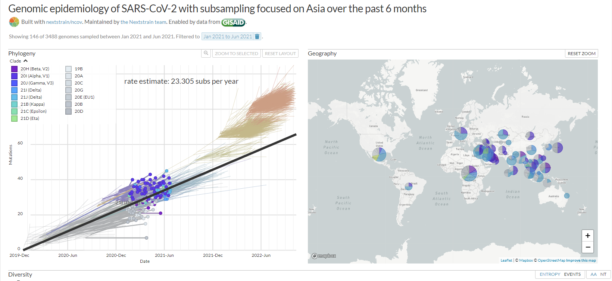

# Basic Phylogenetic Analysis using BEAST 2
## Activity Guide
### A. Alignment of sequences using Multiple alignment using Fast Fourier Transform (MAFFT). 
1. Type `Ubuntu` on your search bar.
2. Click `Ubuntu 18.04.5/Ubuntu 20.04.5`.
3. Navigate to the location of your data by typing 
```bash
cd win-home/Desktop/Phylogenetic\ Analysis\ Training/Data/
```
4. To know the file name, type 
```bash
ls
```
5. Then type
```bash
mafft
```
6. Highlight the file name in step 4 `sars-cov-2.fasta` then press _Ctrl+Shift+C_ then right click in the input file section.
7. For the output file, type
```bash
sars-cov-2_align.fasta
```
**Note: you can name whatever you want for the output file but for uniformity, we will use this output file name**

8. For the output format, type
```bash
4
```
9. For the strategy, choose `auto` by typing 
```bash
1
```
**Note: Again you can choose your desired strategy**

10. For additional arguments, just press `Enter`.
11. If you are okay with your inputs, then just press `Enter`.
12. Wait for the program to finish the alignment. When you see `- - More - - (0%)`, it means that the alignment is finished.
13. You can now exit the application.

### B. Trimming of sequences using Molecular Evolutionary Genetics Analysis (MEGA).
1. In your Desktop, double click `MEGA 7`.
2. Click `File `then `Open a File/Session` then navigate to your aligned fasta file generated in Part **A**.
3. Choose `Align`.
4. For the start of the sequences, click the _last column that has gaps (-)_ then press _Ctrl+Shift+left arrow_. Then press `Delete`. 
5. Go to the end of the sequences. Do the same process at step 4, but press _Ctrl+Shift+right arrow_ until it reaches the end. Then press `Delete`.
6. Yey! You now have the same length for all the sequences. Now, you need to **search** for gaps in between the sequences by pressing _Ctrl+F_ then press `-` (minus sign) then `Enter`.
7. Inspect all columns with gaps. If the column has **more than 2 nucleotides present, DO NOT DELETE the column**. Otherwise, `delete` it.
8. After trimming everything, delete the reference fasta file, `hCoV-19/Wuhan/WIV04/2019/EPI_ISL_402124`.
9. Go to `Data` then `Export Alignment` then `FASTA format`. Save the file in the `training folder`, then rename it to `sars-cov-2_align_trim.fasta`. Then press `Enter`.
10. You can now exit the application.

### C. Generating and Running the XML file.
1. In your Desktop, open the `BEAST folder`, then open `BEAUti`.
2. Click `File`, `Input Alignment`, and select the trimmed file.
3. In the data type of alignment, select `nucleotide` then `OK`.
4. Go to the `Tip Dates` tab and select `Use Tip Dates`. To do this, the sequences used for the analysis should have been labeled with tip dates. Select the _appropriate format of the dates_ in the `as dates with format`. 
5. Click `Auto-configure`. Click `use everything` then select `after last` then type the character that was used in the name of your sequences before the dates. Then click `OK`.
6. Go to the `Site Model` tab and select the substitution model to be used. For uniformity, select `HKY` model then set the gamma category count to `4`.
7. Go to the `Clock Model` tab and select the molecular clock to be used. For uniformity, select `Strict Clock`. For the clock rate, solve this given the formula:
```math
\frac{Substitution\ per\ year}{Length\ of\ the\ sequences}
```

8. Go to the `Priors` tab and select the Tree Prior to be used. For uniformity, select `Phylodynamics: Birth Death SIR (serial)`. You can leave as default the other parameters. \
9. Go to the `MCMC` tab and specify the length of the chain and the frequency of sampling the posterior distribution. It is recommended to have a minimum of 100,000 trees sampled from the posterior. For analysis involving estimation of multiple model parameters or evolutionary dynamics, the length of the chain will need to be increased accordingly. For this training, set the chain length to 50,000. Set the tracelog, screenlog and treelog to 5,000. \
10. Click `Save` in the `File` tab then type `sars-cov-2.xml`. Make sure that that file type is xml.
11. Open **BEAST**. Click `Choose File` and navigate to the directory where the xml file is located. Select the file and click `Open` to load it. Tick the `Use BEAGLE library if available`. 
12. Click `Run` to start the tree estimation process. You will see a java window displaying the progress of the analysis. The analysis will automatically stop once the length of the chain has been reached. BEAST will output log files containing the samples obtained from the posterior for all parameters being estimated and a trees file containing all the phylogenetic trees sampled from the posterior distribution.

### D. Diagnosing Convergence Problems using Tracer.
1. Open the `Tracer` software. Click `File` and select `Import Trace File`. Navigate to the directory where the log file is located. Select the log file and click `Open` to load it.
2. Examine the Effective Sampling Size (ESS) of each continuous parameter. Ideally, all important tree parameters under investigation should have a **minimum ESS of 200**. You can utilize the different options available to visualize the posterior distribution of each estimated parameter.
3. Trace statistics can be improved by increasing the MCMC length of the chain. Additionally, it is possible to simultaneously run the same xml file and combine the output files to improve the ESS values of each parameter.
4. The LogCombiner software can be used to combine one or more log files (or tree files) given that all have been analyzed using the same parameters.

### E. Annotating Phylogenetic Trees
1. Open the `Tree Annotator` software. Specify the burnin as number of states, typically `10%` of the MCMC length of chain.
2. Click choose file in `Input Tree File`. Navigate to the directory where the trees file generated by BEAST is located. Select the trees file and click `Open` to load it.
3. Click choose file in `Output File`. Input the filename `sars-cov-2_annotate.mcc` to be used for the Maximum Clade Credibility (MCC) Tree. Click `Save`.
4. Click `Run` and wait for the annotation to finish.
5. Open the `FigTree` software. Click `File` and select `Open`. Navigate to the directory where the MCC Tree is located. Select the tree file and click `Open` to load it.
6. You can annotate the MCC tree by selecting your preferred annotations that can be found at the left side of the panel. The resulting MCC tree can also be exported into an image or a pdf file.

